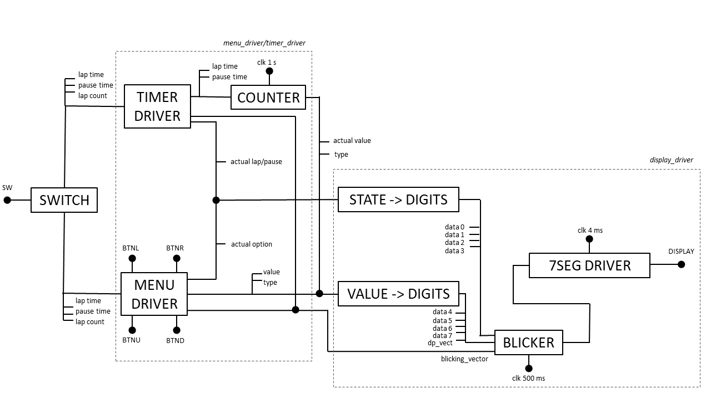

# **Semestrální projekt předmětu BPC-DE1 22/23L**
## *Časovač na intervalový (kruhový) trénink s možností nastavit počet kol, dobu kola a pauzy mezi nimi za běhu aplikace*
### Autoři:
- Vojtěch Tlamka (*architektura, menu driver, timer driver*)
- Vojtěch Kuchař (*dokumentace, display driver*)

### Teoretický úvod do problematiky

Cílem projektu je vytvořit časovač pro kruhový trénink – intervalové cvičení s vysokou intenzitou sloužící k rychlému zlepšení fyzické kondice. Provádí se na určitém počtu stanovišť s jednotlivými cviky probíhajícími po stanovený čas a se stanovenými přestávkami mezi nimi. Z hlediska funkcionality uživatel očekává primárně dva režimy provozu:
  1. Menu, obsahující nastavení počtu kol, cviků a doby trvání cvičení a pauzy
  2. Režim samotného počítání času a indikace kola/pauzy

Implementace návrhu je plánována pro FPGA desku Nexys A7-50T, která nám nabízí využití dvou polí o čtyřech sedmisegmentových displejích. Dále máme k dispozici dvojici RGB LED a 16 jednobarevných LED. K ovládání zařízení máme k dispozici pětici tlačítek a 16 dvoupolohových přepínačů. Co se týče použité logiky, využíváme konečného automatu, čítačů, ovladačů pro soustavu sedmisegmentových displejů s převaděčem z BCD a dalších zařízení složených z logických obvodů a součástek.

### Technický popis a schéma návrhu

Projekt je řešen instanciováním různých součástek v rámci větších celků a ve výsledku v top-levelu. Celý top.vhd je možno rozdělit na *menu_driver/timer_driver* a *display_driver*. Pomocí *menu_driver/timer_driver* je zajišťována logika celého zařízení, v *display_driveru* je implementováno zobrazení hodnot na displeji.

  #### Popis jednotlivých součástek
  
  TIMER DRIVER: Součástka obsahuje šest vstupů: enable (pro aktivaci), clock (synchronizační hodinový signál), lap_time (čas kola), pause_time (čas pauzy), laps (počet kol), btnc (tlačítko pro restart). Zároveň obsahuje pět výstupů: lap_number (aktuální čislo kola), blicking_vector (vektor kurzoru blikání), select_state (kolo/pauza), num_val (hodnota času v sekundách) a value_type (bit, určující čas nebo obyčejnou číselnou hodnotu). V rámci součástky je využita instance clock_enable s periodou 1 sekunda. Dále je implementována logika (procesy) pro pauzu i reset a pro samotný časovač a jeho chování při kolech, pauze a na konci odpočtu. Jako i na více místech v projektu je zde řešen button debouncing – ošetření pro provedení pouze jedné akce při jednom zmáčknutí tlačítka, tedy nastavení časového prahu, do kterého nebude přijímán nový impuls z tlačítka.
  
  MENU DRIVER: Součástka obsahuje devět vstupů: enable (pro aktivaci), clock (synchronizovaný hodinový signál), lap_time (čas kola), pause_time (čas pauzy), laps (počet kol), btnl, btnr, btnu a btnd (vstup z levého, pravého, horního a dolního tlačítka). Zároveň obsahuje sedm výstupů: blinking_vector (vektor kurzoru blikání), select_state (čas kola, čas pauzy, počet kol), num_val (hodnota času/počtu kol), value_type (bit, určující čas nebo obyčejnou číselnou hodnotu), lap_time_out (nastavená hodnota času kola), pause_time_out (nastavená hodnota času pauzy) a laps_o (nastavený počet kol). V součástce je vyřešena logika (procesy) zajišťující správnou odezvu čtyř tlačítek a také jejich button debouncing.
  
  STATE->DIGITS: Součástka má dva vstupy: lap_number (aktuální číslo kola/pauzy), state (aktuální stav). Zároveň má čtyři výstupy pro první čtyři sedmisegmentovky: dig7-4. V rámci součástky jsou řešeny převody ze vstupních údajů o stavu a čísla na zobrazení konkrétních hodnot na sedmisegmentovkách. Následně jsou tato data ve formátu čtyřbitového BCD odeslána na převodník z BCD pro sedmisegmentovku a na driver pro osmičíslicový sedmisegmentový displej.
  
  VALUE->DIGITS: Součástka má dva vstupy: value_type (bit, určující čas nebo číselnou hodnotu) a value (hodnota). Zároveň má pět výstupů pro poslední čtyři sedmisegmentovky dig3-0 a dp_vect (vektor, určující, které desetinné tečky budou svítit). V rámci součástky je logika (procesy), která přepočítává čas v sekundách a zobrazuje čas v minutách a sekundách na sedmisegmentových displejích. Data jsou opět v čtyřbitovém BCD odeslána na převodník a zobrazena pomocí driveru na displeji.
  
  BLICKER: Součástka má jedenáct vstupů: clock (synchronizovaný hodinový signál), blinking_vector (vektor kurzoru blikání) a osm vstupů pro jednotlivé sedmisegmentovky data0-7_in spolu s vektorem desetinné tečky. Zároveň má devět výstupů: data0-7_out pro jednotlivé sedmisegmentovky a dp_vect_out jako vektor desetinné tečky. V rámci součástky je využita další instance clock_enable s periodou 0,5 s. Dále je v součástce vyřešena logika, určující, která část displeje bude problikávat.

### Popis programového vybavení řešení

### Uživatelská příručka a návod k použití

Zařízení pracuje ve dvou režimech, MENU MODE a COUNTER MODE. Pro přepínání mezi režimy použijte přepínač SWITCH 1. V režimu MENU MODE máte možnost nastavit dobu trvání kola (L t = lap time), dobu trvání odpočinku (P t = pause time) a počet kol (LAPS). Po displeji se pohybujete tlačítky BTN L/R, nastavovaná čtveřice sedmisegmentovek je indikována blikáním. Změna hodnoty se provádí tlačítky BTN U/D. Po nastavení hodnot přepněte pomocí SWITCH 1 do COUNTER MODE. Zařízení začne odpočítávat nastavený čas kola. Jeho zbývající hodnota je zobrazena na pravé části displeje, na levé části displeje je indikováno, zda se jedná o kolo nebo pauzu (L/P) a pořadové číslo.
